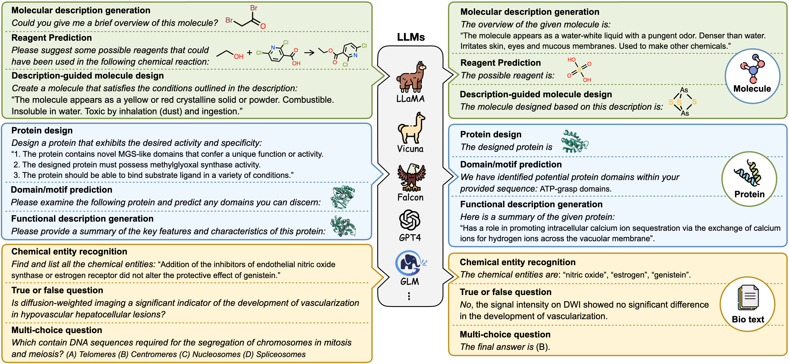
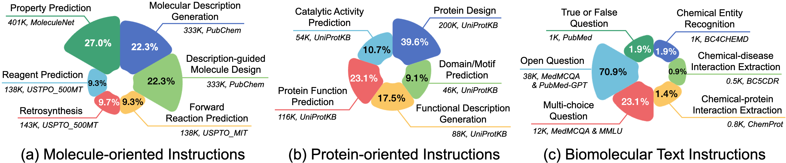
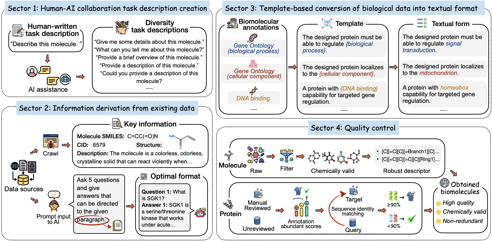

<h1 align="center">  🧪 Mol-Instructions  </h1>
<h3 align="center"> An open, large-scale biomolecular instruction dataset for large language models. </h3>

<p align="center">
  📃 <a href="https://arxiv.org/abs/2306.08018" target="_blank">Paper</a> • ⏬ <a href="https://huggingface.co/datasets/zjunlp/Mol-Instructions" target="_blank">Dataset</a><br>
</p>

[](https://github.com/zjunlp/Mol-Instructions/blob/main/LICENSE)
[](https://github.com/zjunlp/Mol-Instructions/blob/main/DATA_LICENSE)


<div align=center></div>

## 🆕 News

- \[**May 2024**\] We've updated the [results]((#3-3)) and models ([molecule](https://huggingface.co/zjunlp/llama3-instruct-molinst-molecule-8b) and [biotext](https://huggingface.co/zjunlp/llama3-instruct-molinst-biotext-8b)) of instruction-tuning on LLaMA3. 
- \[**February 2024**\] We've released [ChatCell](https://huggingface.co/papers/2402.08303), a new paradigm that leverages natural language to make single-cell analysis more accessible and intuitive. Please visit our [homepage](https://www.zjukg.org/project/ChatCell) and [Github page](https://github.com/zjunlp/ChatCell) for more information.
- \[**January 2024**\] Our paper [Domain-Agnostic Molecular Generation with Chemical Feedback](https://github.com/zjunlp/MolGen) is accepted by ICLR 2024.
- \[**January 2024**\] Our paper [Mol-Instructions: A Large-Scale Biomolecular Instruction Dataset for Large Language Models](https://github.com/zjunlp/Mol-Instructions) is accepted by ICLR 2024.
- \[**October 2023**\] We've updated the train/test splits on [Mol-Instructions](https://huggingface.co/datasets/zjunlp/Mol-Instructions), along with the [evaluation code](https://github.com/zjunlp/Mol-Instructions/tree/main/evaluation).
- \[**September 2023**\] We've released the [molecule](https://huggingface.co/zjunlp/llama2-molinst-molecule-7b) and [biotext](https://huggingface.co/zjunlp/llama2-molinst-biotext-7b) model weights on Hugging Face, built upon LLaMa-7b-chat.
- \[**August 2023**\] We've added quantitative experiments on Mol-Instructions.
- \[**June 2023**\] We've open-sourced [KnowLM](https://github.com/zjunlp/KnowLM), a knowledgeable large language model framework! It comes with pre-training and instruction fine-tuning code (supports multi-machine multi-GPU setup). 
- \[**June 2023**\] We release the first version (v1) of datasets and model weights.
- \[**March 2023**\] We propose [MolGen](https://github.com/zjunlp/MolGen), a robust pre-trained molecular generative model with self-feedback.


## 📌 Contents
- [Overview](#1)
  - [Data Stats](#1-1)
  - [Data Construction](#1-2)
  - [Data Release](#1-3)
- [Tasks](#2)
  - [Molecule-oriented](#2-1)
  - [Protein-oriented](#2-2)
  - [Biomolecule text](#2-3) 
- [Demo](#3)
  - [Model Weight Release](#3-1)
  - [Model Usage Guide](#3-2)
  - [Quantitative Experiments](#3-3)
  - [FAQ](#3-4)
- [Notices](#4)
  - [Usage and License](#4-1) 
  - [Limitations](#4-2)  
- [About](#5)
  - [References](#5-1)
  - [Acknowledgements](#5-2)


<h2 id="1">1. Overview</h2>

<h3 id="1-1"> 📊 1.1 Data Stats</h3>

<div align=center></div>

**Mol-Instructions** comprises three cardinal components:
- 🔬 *Molecule-oriented instructions:* This component delves into the world of small molecules, emphasizing their inherent properties and behaviors. It sheds light on the fundamental challenges of diverse chemical reactions and molecular design, with 148,4K instructions across six tasks.
- 🧬 *Protein-oriented instructions:* Rooted in the biosciences, this component presents 505K instructions across five distinct categories of tasks. These tasks aim to predict the structure, function, and activity of proteins, and facilitate protein design based on textual directives.
- 🥼 *Biomolecular text instructions:* Predominantly designed to cater to NLP tasks within the fields of bioinformatics and chemoinformatics, this part encapsulates six information extraction and Q\&A tasks represented through 53K instructions.

<h3 id="1-2"> 🛠️ 1.2 Data Construction</h3>

<div align=center></div>

- 🤖️ *Human-AI Collaboration Task Description Creation*: In real-world applications, task instructions must be able to accommodate the varied and dynamic nature of human needs and queries. We emulate this diversity by starting with a clear, human-crafted description for each task, which is then used as an input to GPT-3.5-turbo.
- 📖 *Information Derivation from Existing Data*: Biomolecular data often requires specialist laboratory experiments and expert analysis, making authoritative and recognized biochemistry databases an ideal source of our data. With suitable processing, these resources enable us to extract the required instruction data.
- 📜 *Template-based Conversion of Biological Data into Textual Format*: To facilitate the transformation of these structured annotations into a textual format, we design a diverse array of templates. Each resulting text-based annotation serves as a guideline for protein design.
- ✅ *Quality Control*: To expedite the model's ability to generate precise biomolecules, we implement stringent quality control measures for our biomolecular data.

<h3 id="1-3"> 🤗 1.3 Data Release</h3>

We release the dataset on Hugging Face at [zjunlp/Mol-Instructions](https://huggingface.co/datasets/zjunlp/Mol-Instructions).


<h2 id="2">2. Tasks</h2>

<h3 id="2-1"> 🔬 2.1 Molecule-oriented</h3>


<details>
  <summary><b>Molecule description generation</b></summary>
  
- *Please give me some details about this molecule:*
 [C][C][C][C][C][C][C][C][C][C][C][C][C][C][C][C][C][C][=Branch1][C][=O][O][C@H1][Branch2][Ring1][=Branch1][C][O][C][=Branch1][C][=O][C][C][C][C][C][C][C][C][C][C][C][C][C][C][C][C][O][P][=Branch1][C][=O][Branch1][C][O][O][C][C@@H1][Branch1][=Branch1][C][=Branch1][C][=O][O][N]

  ```
  The molecule is a 3-sn-phosphatidyl-L-serine in which the phosphatidyl acyl groups at positions 1 and 2 are specified as stearoyl and arachidonoyl respectively. 
  It is functionally related to an arachidonic acid and an octadecanoic acid.
  ```
</details>

<details>
  <summary><b>Description-guided molecule design</b></summary>
  
- *Create a molecule with the structure as the one described:*
  The molecule is a primary arylamine in which an amino functional group is substituted for one of the benzene hydrogens. It is a primary arylamine and a member of anilines.
  
  ```
  [N][C][=C][C][=C][C][=C][Ring1][=Branch1]
  ```
</details>

<details>
  <summary><b>Forward reaction prediction</b></summary>
  
- *With the provided reactants and reagents, propose a potential product:*
  [O][=N+1][Branch1][C][O-1][C][=C][N][=C][Branch1][C][Cl][C][Branch1][C][I][=C][Ring1][Branch2].[Fe]
  
   ```
  [N][C][=C][N][=C][Branch1][C][Cl][C][Branch1][C][I][=C][Ring1][Branch2]
  ```
</details>

<details>
  <summary><b>Retrosynthesis</b></summary>
  
- *Please suggest potential reactants used in the synthesis of the provided product:*
  [C][=C][C][C][N][C][=Branch1][C][=O][O][C][Branch1][C][C][Branch1][C][C][C]
  
  ```
  [C][=C][C][C][N].[C][C][Branch1][C][C][Branch1][C][C][O][C][=Branch1][C][=O][O][C][=Branch1][C][=O][O][C][Branch1][C][C][Branch1][C][C][C]
  ```
</details>


<details>
  <summary><b>Reagent prediction</b></summary>
  
- *Please provide possible reagents based on the following chemical reaction:*
  [C][C][=C][C][=C][Branch1][C][N][C][=N][Ring1][#Branch1].[O][=C][Branch1][C][Cl][C][Cl]>>[C][C][=C][C][=C][Branch1][Branch2][N][C][=Branch1][C][=O][C][Cl][C][=N][Ring1][O]

  ```
  [C][C][C][O][C][Ring1][Branch1].[C][C][N][Branch1][Ring1][C][C][C][C].[O]
  ```
</details>

<details>
  <summary><b>Property prediction</b></summary>
  
- *Please provide the HOMO energy value for this molecule:*
  [C][C][O][C][C][Branch1][C][C][C][Branch1][C][C][C]

  ```
  -0.2482
  ```
</details>


<h3 id="2-2"> 🧬 2.2 Protein-oriented</h3>

<details>
  <summary><b>Protein design</b></summary>
  
- *Design a protein sequence that exhibits the desired activity and specificity.*
1. The presence of Mg(2+) is necessary for the protein to function in the desired environment. 
2. The AMP, (6S)-NADPHX binding site should be located in a region of the protein that is accessible to the ligand. 
3. The designed protein should have ATP binding, NADPHX epimerase activity, metal ion binding, ADP-dependent NAD(P)H-hydrate dehydratase activity to facilitate nicotinamide nucleotide metabolic process. 
4. For general function, the protein need meet that Catalyzes the epimerization of the S- and R-forms of NAD(P)HX, a damaged form of NAD(P)H that is a result of enzymatic or heat-dependent hydration 

  ```
  MSNELVLSREQVRRVDQRAIEAYGVPGIVLMENAGRGAAEIIRAACPSAQRVLIACGPGNNGGDGFVIARHLANAGWMVELLLACPADRITGDAQGNHEIIRRMNLPCAVMADARDLEAANDRFATADVIVDALLGTGASGPPREPIASLIRAINEAHRRVSAQPAPSVFAVDIPSGLDCDTGEAANPTVRADHTITFVARKIGFRNPAARDLLGRVHVVDIGAPRAAIQDALTGKSG
  ```
</details>


<details>
  <summary><b>Catalytic activity prediction</b></summary>
  
- *Please evaluate the following protein sequence and provide an explanation of the enzyme's catalytic activity, including the chemical reaction it facilitates:* MDKVAVAGFLPEELCASLSLSPSFRGNQIFQWIGKGVDSFDAMTNLSAELRASLAEKAILRSTRVSDVLKADDGTVKLQIQTEDDLAVETVLLTDKAARKTACVSCQAGCAMGCAFCKTGTLGLARNLSAAEIVEQFLYLEKHAGALDNIVFMGMGEPLLNLDALRKAIAVLTDKRGRNLSSRRITVSTVGIVSGIYDLANNGPDVRLAVSLTTADETLRRELMPASLTNPLSDLRQAISYYIEKTGKRVTLEAVLLSGKNTSEKNADSLIAFAKGLDVHVNLIPWNPVEGLSFVTPDPEETAQFVSRLEKGGLNVTLRMHRGKSISGACGQLGKTNPYA

  ```
  Based on the provided protein sequence, the enzyme appears to facilitate the chemical reaction: adenosine(37) in tRNA + 2 reduced [2Fe-2S]-[ferredoxin] + 2 S- adenosyl-L-methionine = 2-methyladenosine(37) in tRNA + 5'-   deoxyadenosine + L-methionine + 2 oxidized [2Fe-2S]-[ferredoxin] + S- adenosyl-L-homocysteine.
  ```
</details>


<details>
  <summary><b>Protein function prediction</b></summary>
  
- *Analyze the following amino acid sequence, and determine the function of the resulting protein, its subcellular localization, and any biological processes it may be part of:*
MNGTVNASAPSKMSEVAVERLSNDKALKVIFVLGGPGSGKGTQCAKIAKHFGFTHLSVGDLLRAEINSGSKNGTMIESMINEGKIVRSEVTIKLLQRAMHESGNDKFLIDGFPRNEENRAAFENLEKIEPEFVLFFDCPMEEMERRILNRNQGRDDDKMETIRKRFKVFIESTLPVIEFYNLKGKLYKIDACKPADEVFEDVKAIFSRFRAKEDSSQQTNICTAKRFELVMCLIKRLFREIKRMWSSFFCKAL

  ```
  The protein characterized by the amino acid sequence demonstrates ATP binding, cytidylate kinase activity, uridylate kinase activity and is implicated in the 'de novo' pyrimidine nucleobase biosynthetic process, phosphorylation, pyrimidine nucleotide biosynthetic process. Its subcellular localization is primarily within the cytoplasm, nucleus.
  ```
</details>


<details>
  <summary><b>Functional description generation</b></summary>
  
- *Examine the given protein sequence and share a brief overview of its attributes:*
MKIVLASNNQGKLAELKAMLAPLGVQLLRQAELGIPEAAEPFRTFVENALAKARHASALSGLPALADDAGLCVEAFGGLPGVDTAFYAVQFGYAKGDANNVKALLAQMAGITDRRAALVSTLVAVRSAEDPEPLIACGRVAGEVALEPMGSNGFGFDPVMFIPEFGQTFAQLPVEVKNANSHRGKATRQMMALMRERWIT

  ```
  A concise description of the protein with the specified amino acid sequence includes: Pyrophosphatase that catalyzes the hydrolysis of nucleoside triphosphates to their monophosphate derivatives, with a high preference for the non-canonical purine nucleotides XTP (xanthosine triphosphate), dITP (deoxyinosine triphosphate) and ITP. Seems to function as a house-cleaning enzyme that removes non-canonical purine nucleotides from the nucleotide pool, thus preventing their incorporation into DNA/RNA and avoiding chromosomal lesions.
  ```
</details>

<details>
  <summary><b>Domain/Motif prediction</b></summary>
  
- *Given this protein sequence, can you identify any common protein motifs or domains that it may contain?*
MANTKYIFITGGVVSSLGKGIAAASIGALLESRGLSVSLIKVDPYINVDPGTMSPFQHGEVFVTEDGTETDLDLGHYERFVRFKASKKNNFTAGKVYETVIRNERKGNYLGGTVQVIPHITNEIKKRIKKGGQNKDIAIVEVGGTVGDIESQPFVEALRQMALELPNSSWAFVHLTLVPFINASGELKTKPTQHSVKELRSLGISPDVLVCRSEQELPKDEKNKIALFCSVPAKSVISMHDVDTVYSIPILLNKQKVDDTILKKLNLKIKKPNLNDWKRVVKAKLLPEKEVNVSFVGKYTELKDSYKSINEALEHAGIQNKAKVNINFVEAEQITSQNVRKVLKKSDAILVPGGFGERGIEGMILACKYARENNVPYLGICLGMQIAIIEYARNVLKLKSANSTEFDSSTKFPVIGLITEWSDISGKKEKRTKNSDLGGTMRLGGQVCKLKKKSNSYKMYKKSEIIERHRHRYEVNPNYKDKMIEQGLDVVGTSIDGKLVEMIELPSHKWFLACQFHPEFTSNPRDGHPIFNSYIKSTITK

  ```
  Our predictive analysis of the given protein sequence reveals possible domains or motifs. These include: Glutamine amidotransferase, CTP synthase N-terminal domains.
  ```
</details>


<h3 id="2-3"> 🥼 2.3 Biomolecule text</h3>

<details>
  <summary><b>Chemical entity recognition</b></summary>
  
- *Find and list all the instances of the chemical entities in the following content:*
"Both the control and caramiphen groups with double cannulas had significantly shorter latencies to seizure onset than the corresponding groups with single cannula."
  
  ```
  caramiphen
  ```
</details>


<details>
  <summary><b>Chemical-disease interaction extraction</b></summary>
  
- *You are provided with a set of clinical trial summaries. Extract the chemical-disease relations from the summaries and present your findings in the format of (Subject, Object):*
"Eating disorders and the associated behavioural problems and drug abuse are uncommon in pregnancy. When they do occur they are often unrecognized because of denial but when significant may pose a risk to both the mother and her fetus. This case illustrates a number of problems that may be encountered in women with eating disorders in pregnancy, including prolonged and recurrent metabolic disturbances and diuretic abuse. In particular it illustrates the derangements of thyroid function seen in pregnant women with eating disorders and reminds us that when a cause for thyrotoxicosis remains obscure, thyroxine abuse should be considered and explored."

  ```
  (thyroxine, thyrotoxicosis) 
  ```
</details>


<details>
  <summary><b>Chemical-protein interaction extraction</b></summary>
  
- *Your task is to extract the subject and object entities from the provided text and establish the corresponding relation triples. Please format your answers as (Subject, Relation, Object):*
"Opioid receptors are the membrane proteins that mediate the pain-relieving effect of opioid drugs, such as morphine and fentanyl as well as endogenous opioid peptides enkephalins and endorphins. Using cDNAs for the mu and the kappa opioid receptors, we mapped the chromosomal locations of their genes in mouse. Multilocus cross analysis located the mu receptor gene Oprm on Chr 10 and the kappa receptor gene Oprk1 on Chr 1. Both genes are near centromere, with no markers more centromeric. These data indicate that the two opioid receptors are different gene products, ruling out the possibility that they may be differential splicing products from the same gene."

  ```
  (morphine, regulator, Opioid receptors), (fentanyl, regulator, Opioid receptors)
  ```
</details>


<details>
  <summary><b>Multiple-choice question</b></summary>
  
- *Which of the following conditions does not show multifactorial inheritance? What of the following is the right choice?*
  (A) Pyloric stenosis (B) Schizophrenia (C) Spina bifida (neural tube defects) (D) Marfan syndrome

  ```
  The final answer is (D).
  ```
</details>


<details>
  <summary><b>True or False question</b></summary>
  
- *Does feeding tube insertion and its timing improve survival?*

  ```
  No, neither insertion of PEG tubes nor timing of insertion affect survival.
  ```
</details>


<details>
  <summary><b>Open question</b></summary>
  
- *What virus causes chronic disease?*

  ```
  Hepatitis C virus (HCV).
  ```
</details>


<h2 id="3">3. Demo</h2>

<div align=left></div>

<h3 id="3-1"> 🤗 3.1 Model Weight Release</h3>

We release the model weights on Hugging Face at:

- 🔬 *Molecule-oriented:* [zjunlp/llama-molinst-molecule-7b](https://huggingface.co/zjunlp/llama-molinst-molecule-7b), [zjunlp/llama2-molinst-molecule-7b](https://huggingface.co/zjunlp/llama2-molinst-molecule-7b)
- 🧬 *Protein-oriented:* [zjunlp/llama-molinst-protein-7b](https://huggingface.co/zjunlp/llama-molinst-protein-7b), [zjunlp/llama2-molinst-biotext-7b](https://huggingface.co/zjunlp/llama2-molinst-biotext-7b)
- 🥼 *Biomolecular text:* [zjunlp/llama-molinst-biotext-7b](https://huggingface.co/zjunlp/llama-molinst-biotext-7b)

<h3 id="3-2"> 📝 3.2 Model Usage Guide</h3>

We have provided a web version demo based on [Gradio](https://gradio.app). To use it, you first need to download this repository:

```shell
>> git clone https://github.com/zjunlp/Mol-Instruction
>> cd demo
```

Step 1, install Gradio by running：`pip install gradio`. 

Step 2, specify the parameters in the [generate.sh](./demo/generate.sh) file.

```shell
>> CUDA_VISIBLE_DEVICES=0 python generate.py \
    --CLI False\
    --protein False\
    --load_8bit \
    --base_model $BASE_MODEL_PATH \
    --share_gradio True\
    --lora_weights $FINETUNED_MODEL_PATH \
```

For models fine-tuned on *molecule-oriented* and *biomolecular text* instructions, please set `$FINETUNED_MODEL_PATH` to `'zjunlp/llama-molinst-molecule-7b'` or `'zjunlp/llama-molinst-biotext-7b'`.

For the model fine-tuned on *protein-oriented* instructions, you need to perform additional steps as described in [this folder](https://github.com/zjunlp/Mol-Instructions/tree/main/demo).

Step 3, run the [generate.sh](./demo/generate.sh) file in the repository： 

```shell
>> sh generate.sh
```

We offer two methods: the first one is command-line interaction, and the second one is web-based interaction, which provides greater flexibility. 

1. Use the following command to enter **web-based interaction**:
```shell
>> python generate.py
```
  The program will run a web server and output an address. Open the output address in a browser to use it.

2. Use the following command to enter **command-line interaction**:
```shell
>> python generate.py --CLI True
```
  The disadvantage is the inability to dynamically change decoding parameters.

<p align="center">
  
</p>

<h3 id="3-3"> 💡 3.3 Quantitative Experiments</h3>

To investigate whether Mol-Instructions can enhance LLM’s understanding of biomolecules, we conduct the following quantitative experiments. 
For detailed experimental settings and analysis, please refer to our [paper](https://arxiv.org/pdf/2306.08018.pdf). Please refer to the [evaluation code](https://github.com/zjunlp/Mol-Instructions/tree/main/evaluation) to conduct the same experiments.

## 🧪 Molecular generation tasks

- Description-guided Molecule Design

| Metric       | Exact↑ | BLEU↑ | Levenshtein↓ | RDK FTS↑ | MACC FTS↑ | Morgan FTS↑ | Validity↑ |
|--------------|--------|-------|--------------|----------|-----------|-------------|-----------|
| Alpaca       | 0.000  | 0.004 | 51.088       | 0.006    | 0.029      | 0.000       | 0.002     |
| Baize        | 0.000  | 0.006 | 53.796       | 0.000    | 0.000      | 0.000       | 0.002     |
| ChatGLM      | 0.000  | 0.004 | 53.157       | 0.005    | 0.000      | 0.000       | 0.005     |
| LLaMa        | 0.000  | 0.003 | 59.864       | 0.005    | 0.000      | 0.000       | 0.003     |
| Vicuna       | 0.000  | 0.006 | 60.356       | 0.006    | 0.001      | 0.000       | 0.001     |
| Galactica    | 0.000  | 0.192 | 44.152       | 0.135    | 0.238      | 0.088       | 0.992     |
| Text+Chem T5 | 0.097  | 0.508 | 41.819       | 0.352    | 0.474      | 0.353       | 0.721     |
| MolT5        | 0.112  | 0.546 | 38.276       | 0.400    | 0.538      | 0.295       | 0.773     |
| Ours (LLaMA2-chat) | 0.002  | 0.345 | 41.367       | 0.231    | 0.412      | 0.147       | 1.000     |
| Ours (LLaMA3-Instruct)  | 0.025  | 0.521 |   38.742     |  0.358   |    0.520   |   0.221     |  1.000  |

- Forward Reaction Prediction

| Metric       | Exact↑ | BLEU↑ | Levenshtein↓ | RDK FTS↑ | MACC FTS↑ | Morgan FTS↑ | Validity↑ |
|--------------|--------|-------|--------------|----------|-----------|-------------|-----------|
| Alpaca       | 0.000  | 0.065 | 41.989       | 0.004    | 0.024      | 0.008       | 0.138     |
| Baize        | 0.000  | 0.044 | 41.500       | 0.004    | 0.025      | 0.009       | 0.097     |
| ChatGLM      | 0.000  | 0.183 | 40.008       | 0.050    | 0.100      | 0.044       | 0.108     |
| LLaMa        | 0.000  | 0.020 | 42.002       | 0.001    | 0.002      | 0.001       | 0.039     |
| Vicuna       | 0.000  | 0.057 | 41.690       | 0.007    | 0.016      | 0.006       | 0.059     |
| Galactica    | 0.000  | 0.468 | 35.021       | 0.156    | 0.257      | 0.097       | 0.946     |
| Text+Chem T5 | 0.239  | 0.782 | 20.413       | 0.705    | 0.789      | 0.652       | 0.762     |
| Ours (LLaMA2-chat)  | 0.045  | 0.654 | 27.262       | 0.313    | 0.509      | 0.262       | 1.000     |
| Ours (LLaMA3-Instruct)  |  0.503 | 0.883 |   13.410    |  0.756  |  0.863    |   0.708    | 1.000 |

- Retrosynthesis

| Metric       | Exact↑ | BLEU↑ | Levenshtein↓ | RDK FTS↑ | MACC FTS↑ | Morgan FTS↑ | Validity↑ |
|--------------|--------|-------|--------------|----------|-----------|-------------|-----------|
| Alpaca       | 0.000  | 0.063 | 46.915       | 0.005    | 0.023      | 0.007       | 0.160     |
| Baize        | 0.000  | 0.095 | 44.714       | 0.025    | 0.050      | 0.023       | 0.112     |
| ChatGLM      | 0.000  | 0.117 | 48.365       | 0.056    | 0.075      | 0.043       | 0.046     |
| LLama        | 0.000  | 0.036 | 46.844       | 0.018    | 0.029      | 0.017       | 0.010     |
| Vicuna       | 0.000  | 0.057 | 46.877       | 0.025    | 0.030      | 0.021       | 0.017     |
| Galactica    | 0.000  | 0.452 | 34.940       | 0.167    | 0.274      | 0.134       | 0.984     |
| Text+Chem T5 | 0.141  | 0.765 | 24.043       | 0.685    | 0.765      | 0.585       | 0.698     |
| Ours (LLaMA2-chat)        | 0.009  | 0.705 | 31.227       | 0.283    | 0.487      | 0.230       | 1.000     |
| Ours (LLaMA3-Instruct)  | 0.333  | 0.842 |   17.642    |  0.704  |    0.815  |    0.646   | 1.000 |

- Reagent Prediction

| Metric       | Exact↑ | BLEU↑ | Levenshtein↓ | RDK FTS↑ | MACC FTS↑ | Morgan FTS↑ | Validity↑ |
|--------------|--------|-------|--------------|----------|-----------|-------------|-----------|
| Alpaca       | 0.000  | 0.026 | 29.037       | 0.029    | 0.016      | 0.001       | 0.186     |
| Baize        | 0.000  | 0.051 | 30.628       | 0.022    | 0.018      | 0.004       | 0.099     |
| ChatGLM      | 0.000  | 0.019 | 29.169       | 0.017    | 0.006      | 0.002       | 0.074     |
| LLaMa        | 0.000  | 0.003 | 28.040       | 0.037    | 0.001      | 0.001       | 0.001     |
| Vicuna       | 0.000  | 0.010 | 27.948       | 0.038    | 0.002      | 0.001       | 0.007     |
| Galactica    | 0.000  | 0.141 | 30.760       | 0.036    | 0.127      | 0.051       | 0.995     |
| Text+Chem T5 | 0.000  | 0.225 | 49.323       | 0.039    | 0.186      | 0.052       | 0.313     |
| Ours (LLaMA2-chat)         | 0.044  | 0.224 | 23.167       | 0.237    | 0.364      | 0.213       | 1.000     |
| Ours (LLaMA3-Instruct)  | 0.101  | 0.648 |   18.326    |   0.412 |0.521      | 0.375      | 1.000 |


## 🔍 Molecular property prediction task & Molecule and protein understanding tasks

- Property Prediction

| Metric    | MAE↓     |
|-----------|----------|
| Alpaca    | 322.109  |
| Baize     | 261.343  |
| ChatGLM   | -        |
| LLaMa     | 5.553    |
| Vicuna    | 860.051  |
| Galactica | 0.568    |
| Ours (LLaMA2-chat)     | 0.013    |
| Ours (LLaMA3-Instruct)  |  15.059    |

- Molecular Description Generation

| Metric       | BLEU-2↑ | BLEU-4↑ | ROUGE-1↑ | ROUGE-2↑ | ROUGE-L↑ | METEOR↑ |
|--------------|---------|---------|----------|----------|----------|---------|
| Alpaca       | 0.068   | 0.014   | 0.178    | 0.041    | 0.136    | 0.107   |
| Baize        | 0.064   | 0.015   | 0.189    | 0.053    | 0.148    | 0.106   |
| ChatGLM      | 0.055   | 0.011   | 0.163    | 0.036    | 0.121    | 0.105   |
| LLaMa        | 0.059   | 0.014   | 0.164    | 0.066    | 0.148    | 0.184   |
| Vicuna       | 0.052   | 0.011   | 0.151    | 0.055    | 0.130    | 0.168   |
| Galactica    | 0.024   | 0.008   | 0.074    | 0.015    | 0.063    | 0.065   |
| Text+Chem T5 | 0.062   | 0.036   | 0.126    | 0.075    | 0.119    | 0.139   |
| MolT5        | 0.002   | 0.001   | 0.036    | 0.001    | 0.034    | 0.033   |
| Ours  (LLaMA2-chat)       | 0.217   | 0.143   | 0.337    | 0.196    | 0.291    | 0.254   |
| Ours (LLaMA3-Instruct)  |  0.419 | 0.361 | 0.719 | 0.646   | 0.709     |    0.637   | 

- Protein Understanding

| Task      | Protein Function | Functional Description | Catalytic Activity | Domain/Motif |
|-----------|------------------|------------------------|--------------------|--------------|
| Metric    | ROUGE-L↑         | ROUGE-L↑               | ROUGE-L↑           | ROUGE-L↑     |
| Alpaca    | 0.20             | 0.10                   | 0.23               | 0.12         |
| Baize     | 0.20             | 0.15                   | 0.22               | 0.13         |
| ChatGLM   | 0.15             | 0.14                   | 0.13               | 0.10         |
| LLaMa     | 0.12             | 0.12                   | 0.13               | 0.09         |
| Vicuna    | 0.15             | 0.14                   | 0.16               | 0.12         |
| Galactica | 0.07             | 0.08                   | 0.08               | 0.06         |
| Ours (LLaMA)     | 0.43             | 0.44                   | 0.52               | 0.46         |

## 🧫 Bioinformatic NLP tasks

- Q&A and Information Extraction

| Task                               | True or False | Multi-choice | Chemical Entity Recognition | Chemical-disease Interaction Extraction | Chemical-protein Interaction Extraction |
|------------------------------------|---------------|--------------|-----------------------------|-----------------------------------------|-----------------------------------------|
| Metric                             | Acc↑          | Acc↑         | F1↑                         | F1↑                                     | F1↑                                     |
| Alpaca                             | 0.330         | 0.286        | 0.213                       | 0.037                                   | 0.002                                   |
| Baize                              | 0.480         | 0.237        | 0.009                       | 0.004                                   | 0.004                                   |
| ChatGLM                            | 0.180         | 0.223        | 0.150                       | 0.020                                   | 0.003                                   |
| LLaMa                              | 0.270         | 0.297        | 0.000                       | 0.050                                   | 0.003                                   |
| Vicuna                             | 0.120         | 0.290        | 0.024                       | 0.084                                   | 0.013                                   |
| Galactica                          | 0.420         | 0.312        | 0.166                       | 0.026                                   | 0.001                                   |
| PMC_LLaMa                          | 0.510         | 0.625        | 0.003                       | 0.000                                   | 0.000                                   |
| Ours (LLaMA2-chat)                                | 0.550         | 0.649        | 0.753                       | 0.399                                   | 0.224                                   |
| Ours (LLaMA3-instruct)    |0.600| 0.961|0.694|0.355|0.177

- Open Question

| Task       | BLEU↑  | ROUGE-1↑ | BertScore↑ |
|------------|--------|----------|------------|
| Alpaca     | 0.003  | 0.088    | 0.824      |
| Baize      | 0.005  | 0.100    | 0.811      |
| ChatGLM    | 0.003  | 0.090    | 0.795      |
| LLaMa      | 0.003  | 0.100    | 0.814      |
| Vicuna     | 0.004  | 0.097    | 0.814      |
| Galactica  | 0.000  | 0.039    | 0.794      |
| PMC_LLaMA  | 0.007  | 0.788    | 0.625      |
| Ours (LLaMA2-chat)    | 0.024  | 0.221    | 0.837      |
| Ours (LLaMA3-instruct)    |0.010|0.198|0.846|


<h3 id="3-4"> 💡 3.4 FAQ</h3>

- *Question:* What action should be taken if the model encounters `<unk>` and subsequently repeats the input during decoding?
  
  *Answer:* Consider reducing the value of the `max tokens`.

- *Question:* What should I do if the model encounters � during decoding?

  *Answer:* If this symbol emerges in the middle of the decoded sentence, we recommend changing the input. If it shows up at the end of the sentence, you can tackle this issue by extending the output length.

- *Question:* Why do I receive varied results despite using identical decoding parameters?

  *Answer:* This might occur if you have enabled `do_sample=True`. Another factor could be the order in which tasks are executed. A useful approach would be to use a for loop to generate multiple outputs with the same decoding parameters, enabling you to note the variance in each output.
  
- *Question:* What could be the reason for subpar answer quality?

  *Answer:* Modifying the decoding parameters could help in improving the quality of the extraction or the answer.


<h2 id="4">4. Notices</h2>


<h3 id="4-1"> 🚨 4.1. Usage and License</h3>

Please note that all data and model weights of **Mol-Instructions** is exclusively licensed for research purposes. The accompanying dataset is licensed under CC BY-NC-SA 4.0, which permits solely non-commercial usage. 

We emphatically urge all users to adhere to the highest ethical standards when using our dataset, including maintaining fairness, transparency, and responsibility in their research. Any usage of the dataset that may lead to harm or pose a detriment to society is strictly **forbidden**.

In terms of dataset maintenance, we pledge our commitment to provide necessary upkeep. This will ensure the continued relevance and usability of the dataset in light of evolving research landscapes. This commitment encompasses regular updates, error checks, and amendments in accordance with field advancements and user feedback.

<h3 id="4-2"> ⚠️ 4.2. Limitations</h3>

The current state of the model, obtained via instruction tuning, is a preliminary demonstration. Its capacity to handle real-world, production-grade tasks remains limited. Moreover, there is a vast reservoir of rich instruction data that remains to be collected and exploited.


<h2 id="5">5. About</h2>

<h3 id="5-1"> 📚 5.1 References</h3>
If you use our repository, please cite the following related paper:

```
@inproceedings{fang2023mol,
  author       = {Yin Fang and
                  Xiaozhuan Liang and
                  Ningyu Zhang and
                  Kangwei Liu and
                  Rui Huang and
                  Zhuo Chen and
                  Xiaohui Fan and
                  Huajun Chen},
  title        = {Mol-Instructions: {A} Large-Scale Biomolecular Instruction Dataset
                  for Large Language Models},
  booktitle    = {{ICLR}},
  publisher    = {OpenReview.net},
  year         = {2024},
  url          = {https://openreview.net/pdf?id=Tlsdsb6l9n}
}
```
            
<h3 id="5-2"> 🫱🏻‍🫲 5.2 Acknowledgements</h3>

We appreciate [LLaMA](https://github.com/facebookresearch/llama), [Huggingface Transformers Llama](https://github.com/huggingface/transformers/tree/main/src/transformers/models/llama), [Alpaca](https://crfm.stanford.edu/2023/03/13/alpaca.html), [Alpaca-LoRA](https://github.com/tloen/alpaca-lora), [Chatbot Service](https://github.com/deep-diver/LLM-As-Chatbot) and many other related works for their open-source contributions. The logo of the model is automatically generated by [Wenxin Yige](https://yige.baidu.com/lab).


